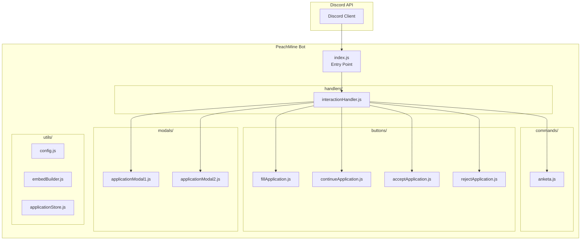
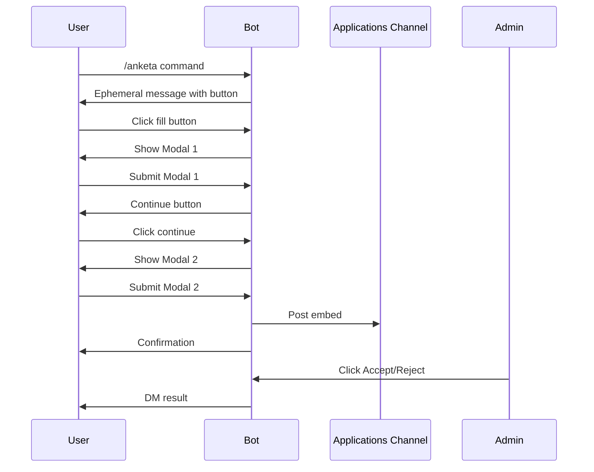

# Design Document: PeachMine Discord Bot

## Overview

The PeachMine Discord Bot is a Node.js application built with discord.js v14 that manages player applications for the PeachMine Minecraft server. The bot implements a multi-step application flow using Discord's interaction system (slash commands, buttons, and modals).

The architecture follows a modular handler-based pattern where each interaction type (commands, buttons, modals) has dedicated handlers. This separation of concerns enables maintainability and testability.

## Architecture



### Application Flow



## Components and Interfaces

### 1. Entry Point (index.js)

Initializes Discord client, loads handlers, registers slash commands.

```javascript
const { Client, GatewayIntentBits, Collection } = require('discord.js');
const config = require('./utils/config');

const client = new Client({
    intents: [GatewayIntentBits.Guilds, GatewayIntentBits.GuildMessages]
});

client.commands = new Collection();
client.buttons = new Collection();
client.modals = new Collection();
```

### 2. Configuration (utils/config.js)

```javascript
module.exports = {
    DISCORD_TOKEN: process.env.DISCORD_TOKEN,
    CLIENT_ID: process.env.CLIENT_ID,
    GUILD_ID: process.env.GUILD_ID,
    ADMIN_ID: process.env.ADMIN_ID,
    APPLICATIONS_CHANNEL_ID: process.env.APPLICATIONS_CHANNEL_ID,
    
    validate() {
        const required = ['DISCORD_TOKEN', 'CLIENT_ID', 'GUILD_ID', 'ADMIN_ID', 'APPLICATIONS_CHANNEL_ID'];
        const missing = required.filter(key => !this[key]);
        if (missing.length > 0) throw new Error(`Missing: ${missing.join(', ')}`);
        return true;
    }
};
```

### 3. Interaction Handler (handlers/interactionHandler.js)

Routes interactions to appropriate handlers based on type.

```javascript
module.exports = {
    async handle(client, interaction) {
        if (interaction.isChatInputCommand()) {
            const command = client.commands.get(interaction.commandName);
            if (command) await command.execute(interaction);
        } 
        else if (interaction.isButton()) {
            const button = client.buttons.get(interaction.customId.split(':')[0]);
            if (button) await button.execute(interaction, client);
        }
        else if (interaction.isModalSubmit()) {
            const modal = client.modals.get(interaction.customId.split(':')[0]);
            if (modal) await modal.execute(interaction, client);
        }
    }
};
```

### 4. Application Store (utils/applicationStore.js)

In-memory storage for partial application data between modals.

```javascript
const applications = new Map();

module.exports = {
    setPartial(userId, data) {
        applications.set(userId, { ...data, timestamp: Date.now() });
    },
    getPartial(userId) { return applications.get(userId); },
    complete(userId) {
        const data = applications.get(userId);
        applications.delete(userId);
        return data;
    }
};
```

### 5. Embed Builder (utils/embedBuilder.js)

Creates application embeds with Accept/Reject buttons.

## Data Models

### Application Data

```javascript
const ApplicationData = {
    userId: String,        // Discord user ID
    username: String,      // Discord username
    nickname: String,      // Minecraft nickname
    age: String,           // User's age
    experience: String,    // Minecraft experience
    whyJoin: String,       // Reason for joining
    timeDedication: String,// Time dedication
    timestamp: Number      // Submission timestamp
};
```

### Application Status

```javascript
const ApplicationStatus = {
    PENDING: { color: 0xFFAA00, text: 'Ожидает рассмотрения' },
    ACCEPTED: { color: 0x00FF00, text: 'Одобрено' },
    REJECTED: { color: 0xFF0000, text: 'Отклонено' }
};
```


## Correctness Properties

*A property is a characteristic or behavior that should hold true across all valid executions of a system—essentially, a formal statement about what the system should do. Properties serve as the bridge between human-readable specifications and machine-verifiable correctness guarantees.*

### Property 1: Command Response Contains Button

*For any* execution of the `/anketa` command, the bot's response SHALL contain a button component with the label "📋 Заполнить анкету".

**Validates: Requirements 1.1**

### Property 2: All Responses Are Ephemeral (Except Embeds)

*For any* user interaction (command, button click, modal submit), the bot's response SHALL have the ephemeral flag set to true, except for application embeds posted to the applications channel.

**Validates: Requirements 1.3, 5.1**

### Property 3: Modal Fields Completeness

*For any* application submission flow, the combined modals SHALL collect all five required fields: Minecraft nickname, age, experience, why join, and time dedication.

**Validates: Requirements 2.2**

### Property 4: Application Data Round-Trip

*For any* valid application data submitted through modals, storing it in the application store and then retrieving it SHALL return equivalent data.

**Validates: Requirements 2.4, 3.1**

### Property 5: Embed Contains All Application Data

*For any* completed application, the generated embed SHALL contain the applicant's username, user ID, and all five answer fields.

**Validates: Requirements 3.2, 3.3**

### Property 6: Admin Access Control

*For any* user attempting to click Accept or Reject buttons, the action SHALL only be processed if the user's ID matches ADMIN_ID; otherwise, an ephemeral error response SHALL be returned.

**Validates: Requirements 4.3, 4.4**

### Property 7: Application Decision Updates Embed

*For any* accepted or rejected application, the embed SHALL be updated with the appropriate color (green for accepted, red for rejected) and footer text indicating the decision.

**Validates: Requirements 4.5**

### Property 8: Configuration Validation

*For any* missing required environment variable, the config validation function SHALL throw an error listing the missing variables.

**Validates: Requirements 5.3, 5.5**

### Property 9: Error Handling Returns User-Friendly Message

*For any* error during interaction handling, the bot SHALL respond with a user-friendly error message in Russian.

**Validates: Requirements 5.2**

## Error Handling

### Interaction Errors

- All interaction handlers are wrapped in try-catch blocks
- Errors are logged to console with `[ERROR]` prefix
- User receives ephemeral message: "Произошла ошибка. Попробуйте позже."
- If interaction already replied/deferred, use `followUp` instead of `reply`

### DM Failures

- If bot cannot send DM to applicant (blocked DMs, etc.):
  - Log error to console
  - Notify admin via ephemeral message
  - Still update the embed status

### Missing Application Data

- If modal 2 is submitted without modal 1 data:
  - Return error message asking user to restart with `/anketa`
  - Log warning to console

### Configuration Errors

- Missing environment variables cause startup failure
- Clear error message listing missing variables
- Bot does not start without valid configuration

## Testing Strategy

### Unit Tests

Unit tests verify specific examples and edge cases:

- Command registration and execution
- Button component creation
- Modal field configuration
- Embed builder output format
- Config validation with missing variables
- Application store operations (set, get, complete)
- Admin ID verification logic

### Property-Based Tests

Property-based tests verify universal properties across generated inputs. Each property test runs minimum 100 iterations.

**Testing Library**: fast-check (JavaScript property-based testing)

**Property Test Tags**: Each test is tagged with format:
`Feature: peachmine-discord-bot, Property {number}: {property_text}`

Property tests to implement:
1. Application data round-trip through store
2. Embed contains all required fields for any valid application data
3. Admin access control rejects all non-admin user IDs
4. Config validation catches any combination of missing variables
5. Error handler always returns user-friendly message

### Integration Tests

- Full application flow from command to embed
- Admin accept/reject flow
- Multi-modal submission flow
- Error recovery scenarios

### Manual Testing Checklist

- [ ] `/anketa` command shows button
- [ ] Button opens modal 1
- [ ] Modal 1 submission shows continue button
- [ ] Continue button opens modal 2
- [ ] Modal 2 submission posts embed
- [ ] Accept button works for admin
- [ ] Reject button works for admin
- [ ] Non-admin cannot use accept/reject
- [ ] DM sent on accept/reject
- [ ] Embed updates after decision
